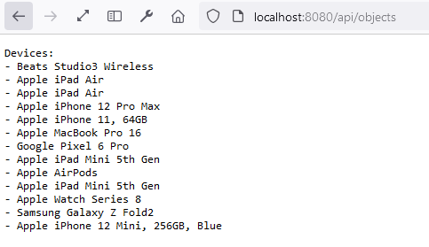

# quarkus-rest-client

This project uses Quarkus, the Supersonic Subatomic Java Framework.

If you want to learn more about Quarkus, please visit its website: <https://quarkus.io/>.

## Running the application in dev mode

You can run your application in dev mode that enables live coding using:

```bash
$ mvn compile quarkus:dev
```

## Running the tests

You can run the tests using:

```bash
$ mvn test
```

## Result in the navigator

Open your browser and navigate to `http://localhost:8080/api/objects` to see the result.



